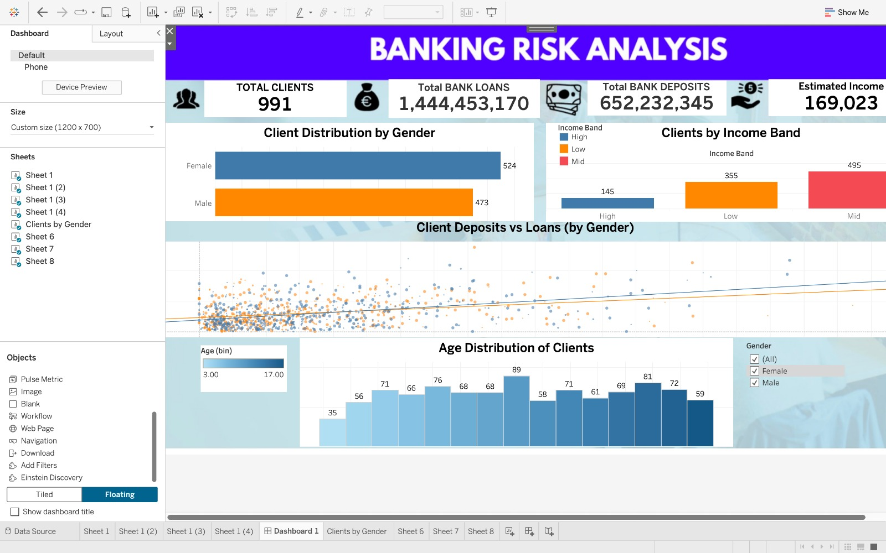

# 🏦 Banking Risk Analysis Dashboard

## 📌 Project Overview

This project analyzes a banking dataset to understand customer behavior, financial distribution, and risk patterns using **Excel, SQL, Python, and Tableau**.

The goal is to transform raw banking data into meaningful insights and present them through an interactive dashboard.

---

## 🧰 Tools & Technologies Used

* **Excel** – Data cleaning & initial exploration
* **SQL** – Data querying and transformation
* **Python (Pandas, Matplotlib, Seaborn)** – Data analysis & preprocessing
* **Tableau** – Interactive dashboard & visualization

---

## 📂 Dataset

The dataset contains customer-level banking information, including:

* Client ID
* Gender
* Age
* Income Band
* Bank Deposits
* Bank Loans
* Estimated Income
* Engagement Metrics

---

## 🔹 Step 1: Data Preparation (Excel)

* Cleaned raw dataset
* Removed inconsistencies and missing values
* Standardized column formats
* Prepared dataset for further analysis

---

## 🔹 Step 2: Data Analysis (SQL)

Performed structured queries to extract insights:

* Total number of clients
* Distribution by gender
* Income band segmentation
* Aggregations of loans and deposits
* Risk-related indicators

📄 SQL queries are included in:
`queries.sql`

---

## 🔹 Step 3: Data Analysis (Python)

Using **Jupyter Notebook**:

* Performed exploratory data analysis (EDA)
* Created distributions and relationships
* Checked correlations between:

  * Deposits vs Loans
  * Income vs Risk indicators
* Generated visual insights for dashboard planning

📄 Notebook file:
`Banking_.ipynb`

---

## 🔹 Step 4: Dashboard (Tableau)

### 📊 Key KPIs

* Total Clients
* Total Bank Loans
* Total Bank Deposits
* Estimated Income

### 📈 Visualizations

* Client Distribution by Gender (Bar Chart)
* Clients by Income Band (Column Chart)
* Deposits vs Loans Relationship (Scatter Plot with Trend Line)
* Age Distribution (Histogram)

### 🎯 Features

* Clean KPI layout
* Interactive filtering
* Trend analysis using regression lines
* Visually structured dashboard design

📄 Tableau file:
`Bankingrisk-analysis-dashboard.twbx`

---

## 🖼️ Dashboard Preview and Live Preview

[](https://public.tableau.com/app/profile/soham.sharma8884/viz/banking-risk-analysis/Dashboard1)
---

## 💡 Key Insights

* Deposits and loans show a positive relationship
* Income band significantly impacts financial behavior
* Gender distribution is relatively balanced
* Most clients fall within mid-income category

---

## 📁 Project Structure

```
banking-risk-analysis/
│
├── data/
│   └── dataset.xlsx
│
├── sql/
│   └── queries.sql
│
├── python/
│   └── analysis.ipynb
│
├── tableau/
│   └── dashboard.twbx
│
└── README.md
```

---

## 🚀 How to Use

1. Open dataset in Excel for review
2. Run SQL queries in your preferred SQL environment
3. Open Jupyter Notebook for Python analysis
4. Open Tableau file to explore the dashboard

---

## 📌 Conclusion

This project demonstrates end-to-end data analysis:

* Data cleaning → SQL → Python → Visualization
* Focused on turning raw financial data into actionable insights

---

